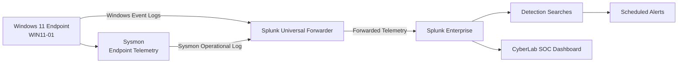
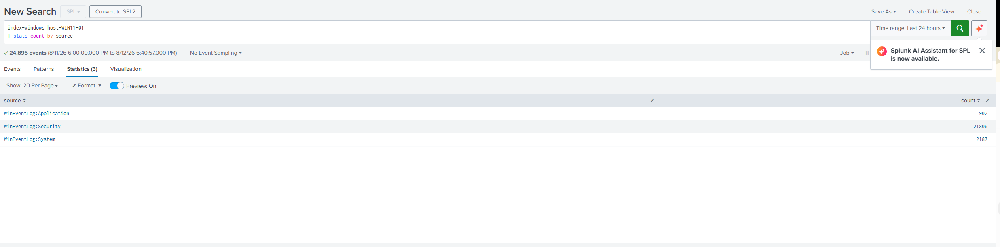

# CyberLab SOC Home Lab

A hands-on Security Operations Center (SOC) home lab built to collect
Windows telemetry, enrich endpoint visibility with Sysmon, develop
Splunk detections, validate alerts, and present security activity
through a SOC dashboard.

## Project Overview

This project simulates a small SOC monitoring workflow. A Windows
endpoint generates native Windows Security events and Sysmon telemetry,
a Splunk Universal Forwarder sends the data to Splunk Enterprise, and
SPL searches turn that telemetry into detections, alerts, and dashboard
panels.

The project focuses on practical blue-team skills: log onboarding,
Windows authentication analysis, endpoint telemetry, SPL development,
detection engineering, alert validation, troubleshooting, and dashboard
creation.

## Project Results

- Centralized Windows Security and Sysmon telemetry in Splunk
- Developed SPL detections for repeated failed logins and suspicious PowerShell activity
- Created scheduled alerts with Medium and High severity classifications
- Investigated PowerShell process creation and outbound network connections
- Built a SOC dashboard to visualize authentication and endpoint security activity
- Troubleshot Windows Event Log forwarding, Sysmon ingestion, and field extraction issues

## Architecture

**Data flow:** Windows Event Logs and Sysmon telemetry are collected from the Windows 11 endpoint by the Splunk Universal Forwarder and sent to Splunk Enterprise. The ingested telemetry is then used for detection searches, scheduled alerts, and SOC dashboard visualizations.

## Technologies

-   Splunk Enterprise
-   Splunk Universal Forwarder
-   Microsoft Windows 11
-   Windows Security Event Logs
-   Sysmon
-   Sysmon Modular configuration
-   PowerShell
-   SPL (Search Processing Language)

## Detection Coverage

| Detection | Telemetry | Severity | Purpose |
| --- | --- | --- | --- |
| Repeated Failed Logins | Windows Event ID 4625 | Medium | Identify repeated authentication failures against user accounts |
| Suspicious PowerShell Execution | Sysmon Event ID 1 | High | Detect PowerShell command lines containing suspicious execution patterns |
| PowerShell Spawning Command Shell | Sysmon Event ID 1 | High | Detect PowerShell launching `cmd.exe` |
| PowerShell Network Activity | Sysmon Event ID 3 | Medium | Surface outbound network connections initiated by PowerShell |

For the complete SPL queries used in this project, see the [Detection Searches](DETECTIONS.md) documentation.

## 1. Windows Endpoint and Domain Configuration

The Windows 11 endpoint WIN11-01 was joined to the cyberlab.local Active Directory domain.
Domain integration provides a realistic enterprise environment for generating
and monitoring Windows authentication activity, including successful and failed
domain logons.

## 2. Windows Log Collection

The Windows endpoint was configured with the Splunk Universal Forwarder
to send Security, Application, and System event logs to the Splunk
server. Successful ingestion was validated in Splunk by grouping events
by source and sourcetype.

## 3. Failed Login Detection

Windows Event ID **4625** was used to monitor failed authentication
attempts. Test failures were generated and then investigated in Splunk
using account name, logon type, source network address, and workstation
fields.

A key troubleshooting discovery was that `Account_Name` was multivalue
in the ingested events. The first value could represent the machine
account while the second represented the failed target account. The
final dashboard logic therefore selects the target account rather than
blindly expanding every value.

### Failed user login count

[Failed User Login Count](DETECTIONS.md#failed-user-logins)

### Failed logins by account

[Failed User Login by Account](DETECTIONS.md#failed-logins-by-account)

## 4. Sysmon Deployment and Forwarding

Sysmon was installed on the Windows endpoint using a modular
configuration to provide richer endpoint telemetry. The Sysmon
Operational event channel was then added to the Universal Forwarder
configuration and validated in Splunk.

During setup, the forwarder initially failed to subscribe to the Sysmon
channel with an access error. Troubleshooting included validating the
event channel locally, checking the effective Splunk input configuration
with `btool`, reviewing `splunkd.log`, and correcting the forwarder's
access before confirming ingestion.

## 5. Process Creation --- Sysmon Event ID 1

Sysmon Event ID **1** provided process creation telemetry including
image path, command line, user, and parent process. This allowed
PowerShell execution to be investigated with much more context than
native process counts alone.

### Suspicious PowerShell search

[Suspicious PowerShell Search](DETECTIONS.md#suspicious-powershell)

## 6. Network Connections --- Sysmon Event ID 3

Sysmon Event ID **3** was used to identify network connections initiated
by processes. PowerShell network activity was filtered to show the
initiating user, source IP, destination IP, protocol, and destination
port.

[PowerShell Network Connections](DETECTIONS.md#powershell-network-connections)

## 7. Alerting

The detections were converted into scheduled Splunk alerts. Repeated
failed logins were assigned **Medium** severity, while suspicious
PowerShell execution and PowerShell-to-command-shell activity were
assigned **High** severity.

The alerts were tested by generating controlled activity on the Windows
endpoint and confirming that Splunk recorded the triggered alerts.

## 8. SOC Dashboard

The final **CyberLab SOC Overview** dashboard provides a compact
operational view of authentication and endpoint activity. The left side
summarizes failed user authentication, while the right side summarizes
suspicious PowerShell activity and network connections.

Dashboard panels:

-   Failed User Logins
-   Failed Logins by Account
-   Suspicious PowerShell Events
-   PowerShell Network Connections

## Troubleshooting Highlights

Several issues required investigation rather than simple configuration
changes:

-   Sysmon events existed locally but initially did not appear in
    Splunk.
-   `splunkd.log` exposed a Windows Event Log subscription/access error.
-   Effective Universal Forwarder settings were validated using `btool`.
-   Sysmon XML events did not initially expose `EventCode` as expected,
    so fields were extracted from `_raw` XML for reliable searches.
-   Windows 4625 `Account_Name` was multivalue, which initially produced
    misleading account counts when `mvexpand` was used.
-   Dashboard searches were refined so the failed-login KPI and account
    chart measure the same population.

These troubleshooting steps were an important part of the project
because they demonstrate validation of the complete telemetry pipeline
rather than assuming that configuration alone means collection is
working.

## Skills Demonstrated

-   SIEM administration and log onboarding
-   Splunk SPL search development
-   Windows Event Log analysis
-   Sysmon deployment and telemetry analysis
-   Detection engineering
-   Alert development and validation
-   PowerShell behavior analysis
-   Authentication monitoring
-   Endpoint network telemetry analysis
-   Troubleshooting log pipelines
-   SOC dashboard development

## Key Takeaway

This lab demonstrates an end-to-end detection workflow: **generate
activity → collect telemetry → investigate events → develop detections →
create alerts → visualize results**. It also documents the
troubleshooting required to make the pipeline reliable, which is a
critical part of real SOC engineering work.

## Repository Notes

The activity in this repository was generated in an isolated home-lab
environment for defensive security learning and detection validation.
Hostnames, usernames, addresses, and event data shown in screenshots
belong to the lab environment.
